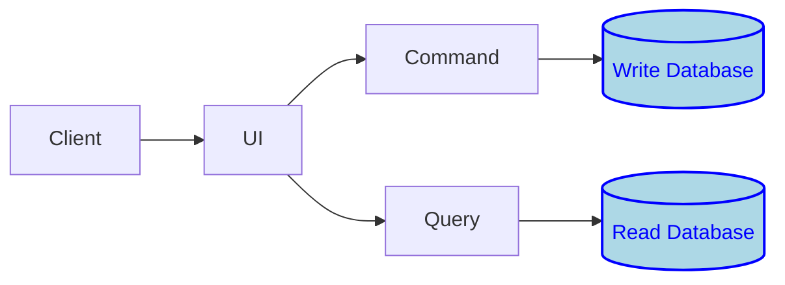

# CQRS

CQRS stands for Command Query Responsibility Segregation. It is a software architectural pattern that separates the modification commands from the data queries, treating them as two distinct concerns. Here's a breakdown:

1. Command

    This represents an intention to change state. Commands should be task-oriented, often capturing a user intention like "CreateOrder" or "CancelSubscription". Commands are typically handled by a single aggregate in the domain-driven design context.

3. Query

    This represents a request to retrieve state. Queries should be read-only and won't have side effects.

The main motivations behind CQRS are:

- Scalability

    By separating the read and write sides, each can be scaled independently. For example, in many systems, read operations are much more frequent than write operations. Thus, you can scale out the read side to handle the load without affecting the write side.

- Flexibility

    Different storage mechanisms can be used for the read and write sides. For example, you could use a relational database for writes, capturing all the rich behavior and constraints, and a fast read-optimized store (like a NoSQL database) for reads.

- Simplification

    By separating concerns, you can model your domain more purely. Commands can be focused on ensuring business invariants, and queries can be optimized for the UI or reporting needs.

- Enhanced Security

    You can apply different security rules for read and write operations.

It's worth noting that while CQRS brings many advantages, it also introduces complexity, especially in systems where strong consistency between the read and write sides is required. As with any pattern, it's crucial to understand the trade-offs and ensure it's a good fit for the specific use case.

Often, CQRS is used in conjunction with Event Sourcing (ES). Event Sourcing ensures that every change to the state of an application is captured as an event. These events can then be replayed to reconstruct the system's state, and they can be used to build up the read-optimized views required by the CQRS pattern. However, while they complement each other nicely, CQRS and ES can be used independently.

